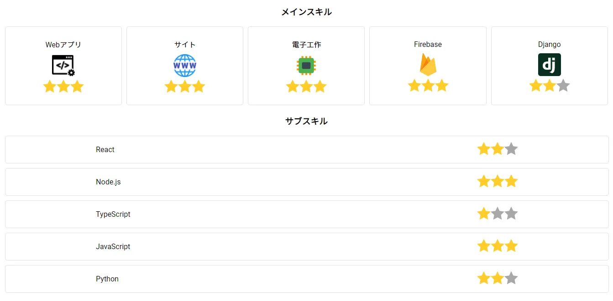
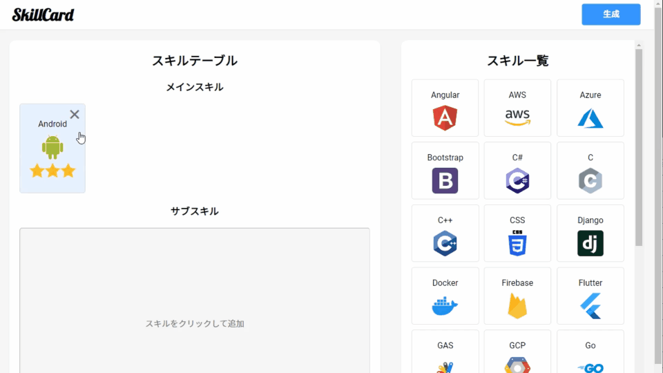

SkillCard
====

## Description
自分の技術スキルを可視化・共有するWebアプリです．
自分ができることを明確にし，チーム内で共有することで，より効率的な開発が可能となります．

## Demo
[https://nitfc-skillcard.herokuapp.com/generator](https://nitfc-skillcard.herokuapp.com/generator)

## Usage
1. スキル一覧内のアイテムをクリックすると，スキルテーブルの方に移動されます．戻したいときは，アイテム右上に表示される×ボタンを押してください．

2. スキルテーブル内のアイテムをクリックすると，スキルレベルを変更できます．

3. 生成ボタンを押すとスキルカードが生成されます．

## Licence
[MIT](LICENSE)